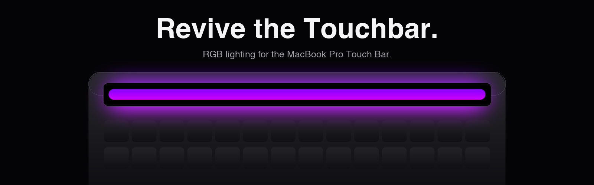
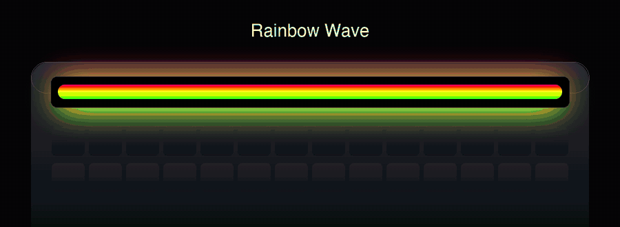
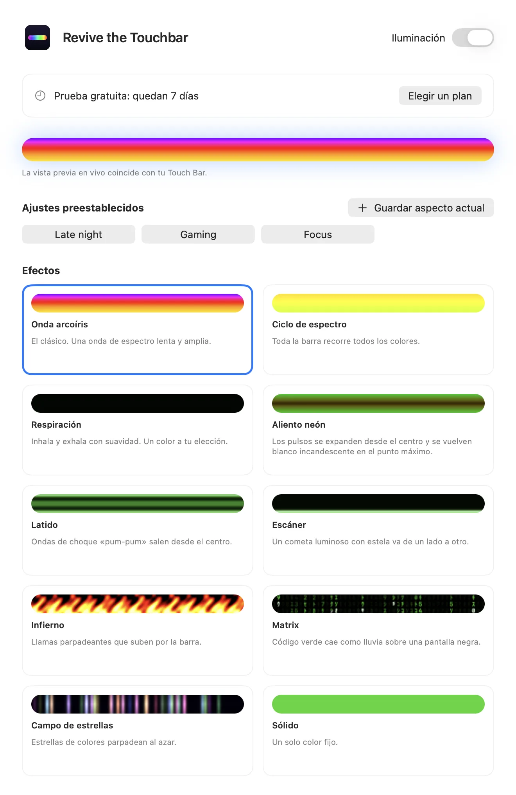
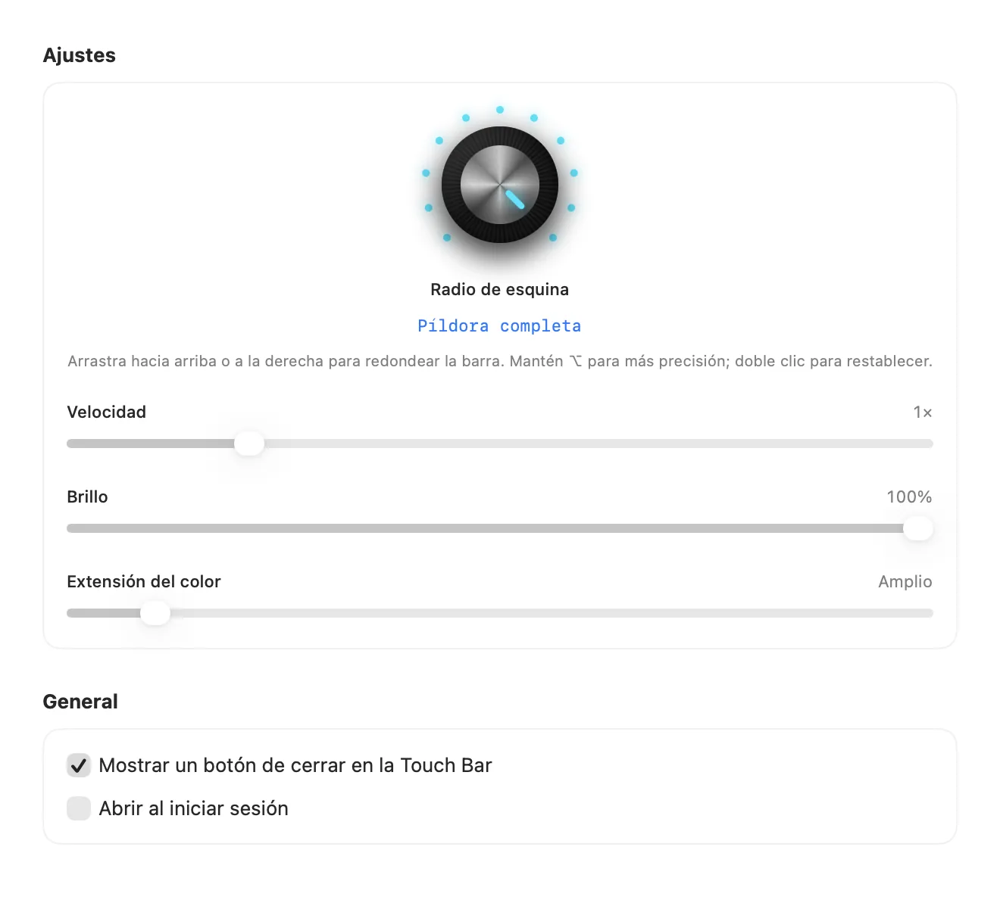

Léelo en: [English](README.md) · **Español** · [Português (Brasil)](README.pt-BR.md) · [Français](README.fr.md) · [हिन्दी](README.hi.md) · [简体中文](README.zh-CN.md)

# Revive the Touchbar

**Iluminación RGB para la Touch Bar del MacBook Pro.**

Una app de la barra de menús que convierte tu Touch Bar en una tira de luz viva. Ondas arcoíris, respiración neón, código que cae y más, ajustado con una perilla real.

<a href="https://revivethetouchbar.com/?lang=es"><b>Descargar para Mac</b></a> &nbsp;·&nbsp; <a href="https://revivethetouchbar.com/?lang=es">Sitio web</a>

## Míralo en movimiento

Diez efectos, generados por el mismo motor que usa la app. [Ver la demo completa (MP4)](assets/demo-all-effects.mp4)

## Diez efectos

Spectrum Cycle y Matrix son gratis. El resto se desbloquea con una licencia.

`Rainbow Wave` · `Spectrum Cycle` · `Breathing` · `Neon Breath` · `Heartbeat` · `Scanner` · `Inferno` · `Matrix` · `Starfield` · `Solid`

## Ajústalo a mano

Una perilla estilo sintetizador define la forma de las esquinas, de cuadrada a píldora completa. Los controles deslizantes ajustan velocidad, brillo, color y ancho. Guarda tus favoritos como ajustes preestablecidos y cámbialos desde la barra de menús.

 

## Planes

| Plan | Precio | Qué incluye |
| --- | --- | --- |
| Gratis | $0 | Spectrum Cycle y Matrix, después de una prueba de 7 días con todo. |
| Pro De por vida | $9.99 una vez | Todos los efectos y controles, para siempre. Muestra una pequeña tarjeta de patrocinador. |
| Pro Mensual | $1.99 / mes | Todo, sin tarjeta de patrocinador. Cancela cuando quieras. |

Los precios se muestran en tu moneda local al pagar.

## Empieza

1. Descarga la app desde [revivethetouchbar.com](https://revivethetouchbar.com/?lang=es).
2. Abre el DMG y arrastra **Revive the Touchbar** a Aplicaciones.
3. Ábrela. Vive en la barra de menús; abre Ajustes para elegir un efecto.

## Requisitos

- Un MacBook Pro con Touch Bar
- macOS 13 Ventura o posterior

## Preguntas

**¿Por qué no está en la Mac App Store?**

Muestra su propia Touch Bar con una función del sistema que Apple no ofrece en sus herramientas públicas para desarrolladores, así que se distribuye directamente. La app está firmada y notarizada por Apple.

**¿Puedo apagarlo?**

Sí. Usa el interruptor Lighting del ícono de la barra de menús y tu Touch Bar vuelve a la normalidad.

**¿Cómo cancelo el plan mensual?**

Abre Ajustes y elige Manage Subscription. Mantienes el acceso hasta que termine el período.

## Ayuda y comentarios

¿Encontraste un error o quieres un efecto? [Abre un issue](../../issues/new/choose), inicia una [discusión](../../discussions) o escribe a [isaacmendezrosario@icloud.com](mailto:isaacmendezrosario@icloud.com).

Si te gusta, una estrella ayuda a que otras personas lo encuentren.

---

Revive the Touchbar es un producto independiente y no está afiliado ni respaldado por Apple Inc. MacBook Pro y Touch Bar son marcas de Apple Inc. Este repositorio contiene la página pública, los medios y el rastreador de incidencias; el código de la app es cerrado.
