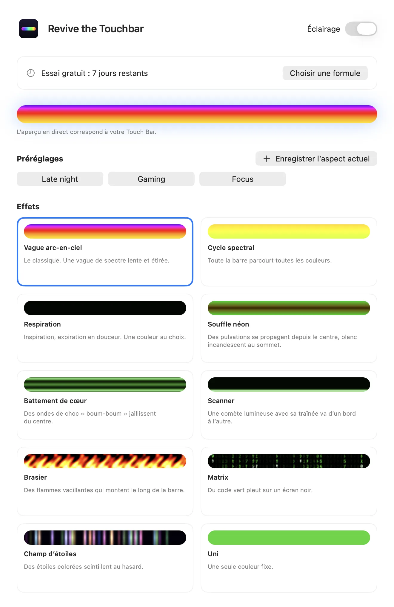
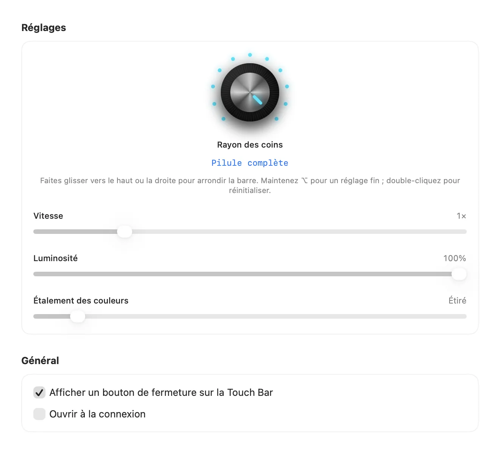

Lire en: [English](README.md) · [Español](README.es.md) · [Português (Brasil)](README.pt-BR.md) · **Français** · [हिन्दी](README.hi.md) · [简体中文](README.zh-CN.md)

# Revive the Touchbar

**Éclairage RGB pour la Touch Bar du MacBook Pro.**

Une app de barre des menus qui transforme votre Touch Bar en bandeau lumineux vivant. Vagues arc-en-ciel, respiration néon, code qui tombe et plus, réglés avec un vrai bouton.

<a href="https://revivethetouchbar.com/?lang=fr"><b>Télécharger pour Mac</b></a> &nbsp;·&nbsp; <a href="https://revivethetouchbar.com/?lang=fr">Site web</a>

## Voyez-le bouger

Dix effets, générés par le même moteur que l'app. [Voir la démo complète (MP4)](assets/demo-all-effects.mp4)

## Dix effets

Spectrum Cycle et Matrix sont gratuits. Les autres se débloquent avec une licence.

`Rainbow Wave` · `Spectrum Cycle` · `Breathing` · `Neon Breath` · `Heartbeat` · `Scanner` · `Inferno` · `Matrix` · `Starfield` · `Solid`

## Réglez-le à la main

Un bouton façon synthétiseur règle la forme des coins, du carré à la pilule complète. Des curseurs contrôlent la vitesse, la luminosité, la couleur et la largeur. Enregistrez vos favoris en préréglages et changez depuis la barre des menus.

 

## Formules

| Formule | Prix | Ce que vous obtenez |
| --- | --- | --- |
| Gratuit | 0 $ | Spectrum Cycle et Matrix, après un essai de 7 jours de tout. |
| Pro À vie | $9.99 une fois | Tous les effets et tous les réglages, pour toujours. Affiche une petite carte de sponsor. |
| Pro Mensuel | $1.99 / mois | Tout, sans carte de sponsor. Résiliable à tout moment. |

Les prix s'affichent dans votre devise locale au paiement.

## Pour commencer

1. Téléchargez l'app sur [revivethetouchbar.com](https://revivethetouchbar.com/?lang=fr).
2. Ouvrez le DMG et glissez **Revive the Touchbar** dans Applications.
3. Lancez-la. Elle vit dans la barre des menus ; ouvrez Réglages pour choisir un effet.

## Configuration requise

- Un MacBook Pro avec Touch Bar
- macOS 13 Ventura ou ultérieur

## Questions

**Pourquoi n'est-elle pas sur le Mac App Store ?**

Elle affiche sa propre Touch Bar grâce à une fonction système qu'Apple ne propose pas dans ses outils publics pour développeurs ; elle est donc distribuée directement. L'app est signée et notariée par Apple.

**Puis-je l'éteindre ?**

Oui. Utilisez l'interrupteur Lighting de l'icône dans la barre des menus, et votre Touch Bar redevient normale.

**Comment résilier l'abonnement mensuel ?**

Ouvrez Réglages et choisissez Manage Subscription. Vous gardez l'accès jusqu'à la fin de la période.

## Aide et retours

Un bug ou une idée d'effet ? [Ouvrez un ticket](../../issues/new/choose), lancez une [discussion](../../discussions) ou écrivez à [isaacmendezrosario@icloud.com](mailto:isaacmendezrosario@icloud.com).

Si l'app vous plaît, une étoile aide d'autres personnes à la trouver.

---

Revive the Touchbar est un produit indépendant, non affilié à Apple Inc. ni approuvé par elle. MacBook Pro et Touch Bar sont des marques d'Apple Inc. Ce dépôt contient la page publique, les médias et le suivi des tickets ; le code de l'app est fermé.
