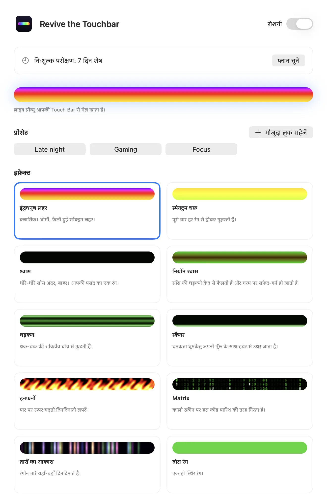
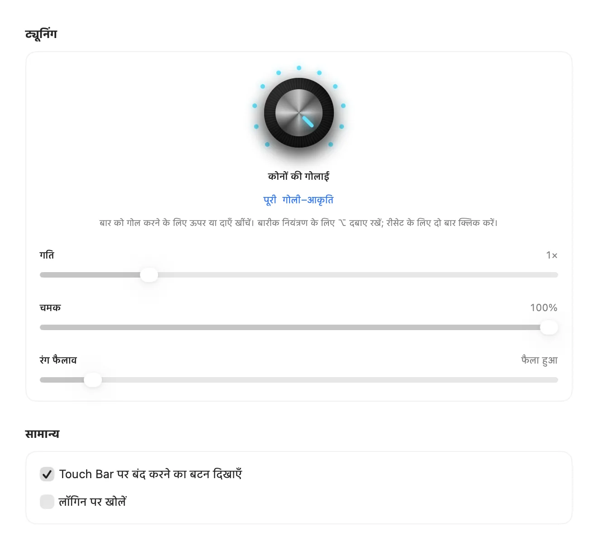

इसे इस भाषा में पढ़ें: [English](README.md) · [Español](README.es.md) · [Português (Brasil)](README.pt-BR.md) · [Français](README.fr.md) · **हिन्दी** · [简体中文](README.zh-CN.md)

# Revive the Touchbar

**MacBook Pro Touch Bar के लिए RGB लाइटिंग।**

एक मेन्यू बार ऐप जो आपके Touch Bar को जीवंत लाइट स्ट्रिप बना देता है। रेनबो वेव, नियॉन ब्रीदिंग, गिरता कोड और बहुत कुछ, असली नॉब से ट्यून करें।

<a href="https://revivethetouchbar.com/?lang=hi"><b>Mac के लिए डाउनलोड करें</b></a> &nbsp;·&nbsp; <a href="https://revivethetouchbar.com/?lang=hi">वेबसाइट</a>

## इसे चलते देखें

दस इफ़ेक्ट, उसी इंजन से बने जो ऐप इस्तेमाल करता है। [पूरा डेमो देखें (MP4)](assets/demo-all-effects.mp4)

## दस इफ़ेक्ट

Spectrum Cycle और Matrix मुफ़्त हैं। बाकी लाइसेंस से खुलते हैं।

`Rainbow Wave` · `Spectrum Cycle` · `Breathing` · `Neon Breath` · `Heartbeat` · `Scanner` · `Inferno` · `Matrix` · `Starfield` · `Solid`

## हाथ से ट्यून करें

सिंथेसाइज़र-स्टाइल नॉब कोनों का आकार तय करता है, चौकोर से पूरी पिल तक। स्लाइडर गति, चमक, रंग और चौड़ाई संभालते हैं। पसंदीदा सेटिंग्स को प्रीसेट के रूप में सहेजें और मेन्यू बार से बदलें।

 

## प्लान

| प्लान | कीमत | क्या मिलता है |
| --- | --- | --- |
| मुफ़्त | $0 | सब कुछ के 7 दिन के ट्रायल के बाद Spectrum Cycle और Matrix। |
| लाइफ़टाइम | $9.99 एक बार | हर इफ़ेक्ट और हर कंट्रोल, हमेशा के लिए। एक छोटा स्पॉन्सर कार्ड दिखता है। |
| मासिक | $1.99 / माह | सब कुछ, बिना स्पॉन्सर कार्ड के। कभी भी रद्द करें। |

चेकआउट पर कीमतें आपकी स्थानीय मुद्रा में दिखती हैं।

## शुरू करें

1. [revivethetouchbar.com](https://revivethetouchbar.com/?lang=hi) से ऐप डाउनलोड करें।
2. DMG खोलें और **Revive the Touchbar** को Applications में खींचें।
3. ऐप चलाएँ। यह मेन्यू बार में रहता है; इफ़ेक्ट चुनने के लिए Settings खोलें।

## आवश्यकताएँ

- Touch Bar वाला MacBook Pro
- macOS 13 Ventura या उसके बाद का

## सवाल

**यह Mac App Store में क्यों नहीं है?**

यह एक ऐसे सिस्टम फ़ीचर से अपना Touch Bar दिखाता है जो Apple अपने सार्वजनिक डेवलपर टूल में नहीं देता, इसलिए इसे सीधे बाँटा जाता है। ऐप Apple द्वारा साइन और नोटराइज़ किया गया है।

**क्या मैं इसे बंद कर सकता हूँ?**

हाँ। मेन्यू बार आइकन में Lighting स्विच इस्तेमाल करें, और आपका Touch Bar पहले जैसा हो जाएगा।

**मासिक प्लान कैसे रद्द करूँ?**

Settings खोलें और Manage Subscription चुनें। अवधि खत्म होने तक आपकी पहुँच बनी रहती है।

## मदद और फ़ीडबैक

बग मिला या कोई इफ़ेक्ट चाहिए? [इश्यू खोलें](../../issues/new/choose), [चर्चा](../../discussions) शुरू करें, या [isaacmendezrosario@icloud.com](mailto:isaacmendezrosario@icloud.com) पर लिखें।

अगर पसंद आए तो एक स्टार दूसरों को इसे खोजने में मदद करता है।

---

Revive the Touchbar एक स्वतंत्र उत्पाद है और Apple Inc. से संबद्ध या उसके द्वारा समर्थित नहीं है। MacBook Pro और Touch Bar Apple Inc. के ट्रेडमार्क हैं। इस रिपॉज़िटरी में सार्वजनिक पेज, मीडिया और इश्यू ट्रैकर है; ऐप का सोर्स कोड बंद है।
