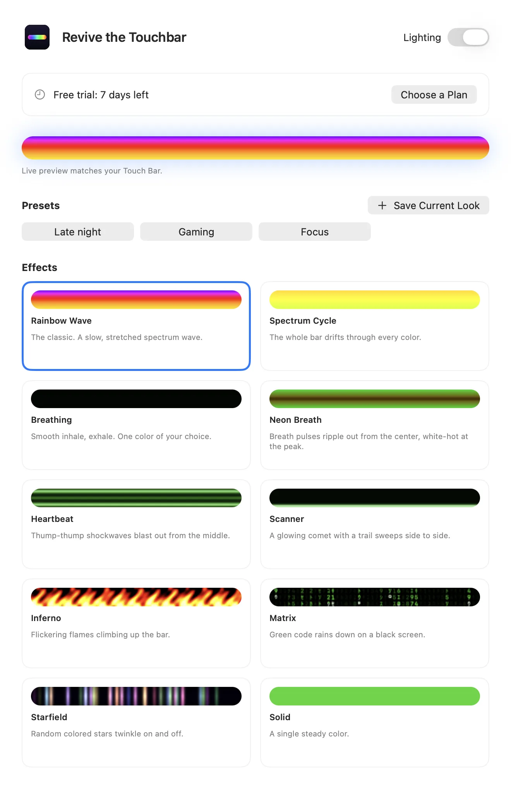
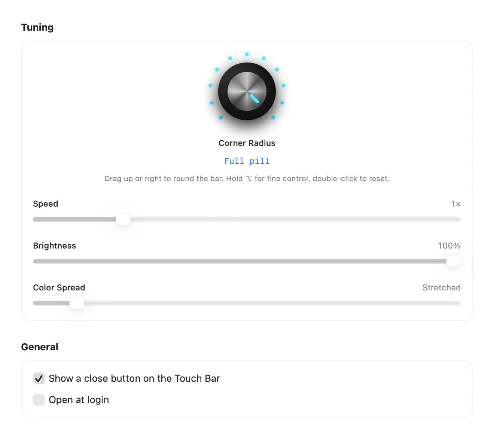

Read this in: **English** · [Español](README.es.md) · [Português (Brasil)](README.pt-BR.md) · [Français](README.fr.md) · [हिन्दी](README.hi.md) · [简体中文](README.zh-CN.md)

# Revive the Touchbar

**RGB lighting for the MacBook Pro Touch Bar.**

A menu bar app that turns your Touch Bar into a living light strip. Rainbow waves, neon breathing, falling code and more, tuned with a real knob.

<a href="https://revivethetouchbar.com"><b>Download for Mac</b></a> &nbsp;·&nbsp; <a href="https://revivethetouchbar.com">Website</a>

## See it move

Ten effects, rendered by the same engine the app uses. [Watch the full demo (MP4)](assets/demo-all-effects.mp4)

## Ten effects

Spectrum Cycle and Matrix are free. The rest unlock with a license.

`Rainbow Wave` · `Spectrum Cycle` · `Breathing` · `Neon Breath` · `Heartbeat` · `Scanner` · `Inferno` · `Matrix` · `Starfield` · `Solid`

## Tune it by hand

A synth-style knob sets the corner shape from square to full pill. Sliders control speed, brightness, color, and width. Save your favorites as presets and switch from the menu bar.

 

## Plans

| Plan | Price | What you get |
| --- | --- | --- |
| Free | $0 | Spectrum Cycle and Matrix, after a 7-day trial of everything. |
| Pro Lifetime | $9.99 once | Every effect and every control, forever. Shows a small sponsor card. |
| Pro Monthly | $1.99 / month | Everything, no sponsor card. Cancel any time. |

Prices are shown in your local currency at checkout.

## Get started

1. Download the app from [revivethetouchbar.com](https://revivethetouchbar.com).
2. Open the DMG and drag **Revive the Touchbar** to Applications.
3. Launch it. It lives in your menu bar; open Settings to pick an effect.

## Requirements

- A MacBook Pro with a Touch Bar
- macOS 13 Ventura or later

## Questions

**Why isn't it on the Mac App Store?**

It shows its own Touch Bar using a system feature Apple doesn't offer through its public developer tools, so it is distributed directly. The app is signed and notarized by Apple.

**Can I turn it off?**

Yes. Use the Lighting switch in the menu bar item, and your Touch Bar goes back to normal.

**How do I cancel Monthly?**

Open Settings and choose Manage Subscription. You keep access until the period ends.

## Help and feedback

Found a bug or want an effect? [Open an issue](../../issues/new/choose), start a [discussion](../../discussions), or email [isaacmendezrosario@icloud.com](mailto:isaacmendezrosario@icloud.com).

If you like it, a star helps other people find it.

---

Revive the Touchbar is an independent product and is not affiliated with or endorsed by Apple Inc. MacBook Pro and Touch Bar are trademarks of Apple Inc. This repository holds the public page, media, and issue tracker; the app's source code is closed.
