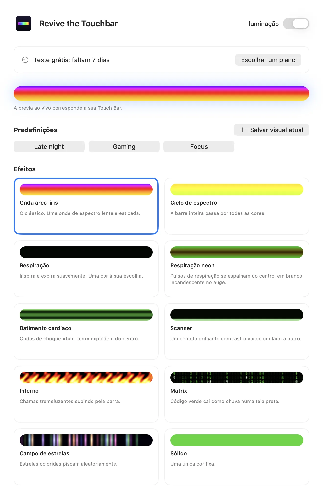
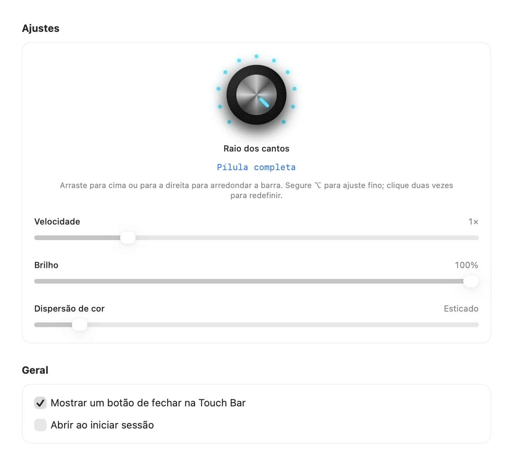

Leia em: [English](README.md) · [Español](README.es.md) · **Português (Brasil)** · [Français](README.fr.md) · [हिन्दी](README.hi.md) · [简体中文](README.zh-CN.md)

# Revive the Touchbar

**Iluminação RGB para a Touch Bar do MacBook Pro.**

Um app da barra de menus que transforma sua Touch Bar em uma faixa de luz viva. Ondas arco-íris, respiração neon, código caindo e mais, ajustados com um botão de verdade.

<a href="https://revivethetouchbar.com/?lang=pt"><b>Baixar para Mac</b></a> &nbsp;·&nbsp; <a href="https://revivethetouchbar.com/?lang=pt">Site</a>

## Veja em movimento

Dez efeitos, gerados pelo mesmo motor que o app usa. [Assistir à demo completa (MP4)](assets/demo-all-effects.mp4)

## Dez efeitos

Spectrum Cycle e Matrix são gratuitos. Os outros são liberados com uma licença.

`Rainbow Wave` · `Spectrum Cycle` · `Breathing` · `Neon Breath` · `Heartbeat` · `Scanner` · `Inferno` · `Matrix` · `Starfield` · `Solid`

## Ajuste à mão

Um botão estilo sintetizador define o formato dos cantos, de quadrado a pílula completa. Controles deslizantes ajustam velocidade, brilho, cor e largura. Salve seus favoritos como predefinições e troque pela barra de menus.

 

## Planos

| Plano | Preço | O que inclui |
| --- | --- | --- |
| Grátis | $0 | Spectrum Cycle e Matrix, depois de um teste de 7 dias com tudo. |
| Pro Vitalício | $9.99 uma vez | Todos os efeitos e controles, para sempre. Mostra um pequeno cartão de patrocinador. |
| Pro Mensal | $1.99 / mês | Tudo, sem cartão de patrocinador. Cancele quando quiser. |

Os preços aparecem na sua moeda local no pagamento.

## Comece

1. Baixe o app em [revivethetouchbar.com](https://revivethetouchbar.com/?lang=pt).
2. Abra o DMG e arraste **Revive the Touchbar** para Aplicativos.
3. Abra o app. Ele fica na barra de menus; abra Ajustes para escolher um efeito.

## Requisitos

- Um MacBook Pro com Touch Bar
- macOS 13 Ventura ou posterior

## Perguntas

**Por que não está na Mac App Store?**

Ele exibe sua própria Touch Bar usando um recurso do sistema que a Apple não oferece nas ferramentas públicas para desenvolvedores, então é distribuído diretamente. O app é assinado e notarizado pela Apple.

**Posso desligar?**

Sim. Use a chave Lighting no ícone da barra de menus e sua Touch Bar volta ao normal.

**Como cancelo o plano mensal?**

Abra Ajustes e escolha Manage Subscription. Você mantém o acesso até o fim do período.

## Ajuda e feedback

Achou um bug ou quer um efeito? [Abra uma issue](../../issues/new/choose), inicie uma [discussão](../../discussions) ou escreva para [isaacmendezrosario@icloud.com](mailto:isaacmendezrosario@icloud.com).

Se você gostou, uma estrela ajuda outras pessoas a encontrá-lo.

---

Revive the Touchbar é um produto independente e não é afiliado nem endossado pela Apple Inc. MacBook Pro e Touch Bar são marcas da Apple Inc. Este repositório contém a página pública, as mídias e o rastreador de problemas; o código do app é fechado.
