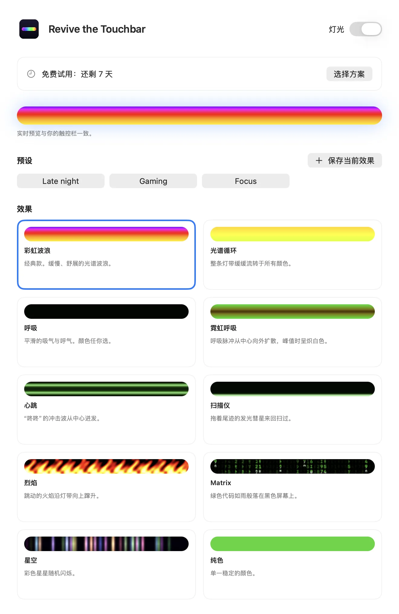
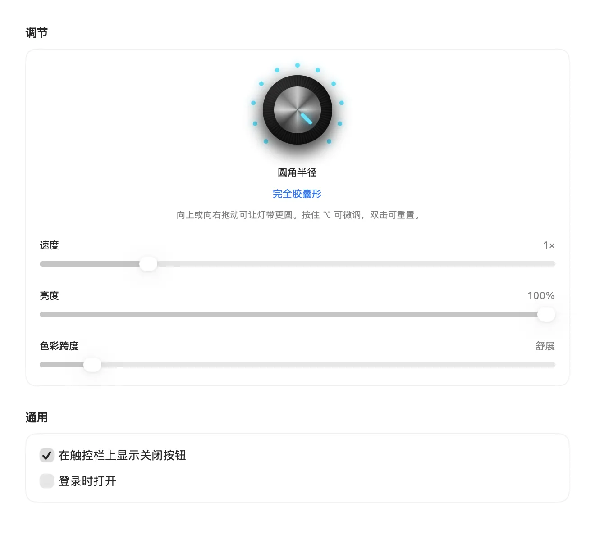

阅读语言: [English](README.md) · [Español](README.es.md) · [Português (Brasil)](README.pt-BR.md) · [Français](README.fr.md) · [हिन्दी](README.hi.md) · **简体中文**

# Revive the Touchbar

**为 MacBook Pro 触控栏带来 RGB 灯效。**

一款菜单栏应用，把触控栏变成灵动的灯带。彩虹波浪、霓虹呼吸、下落的代码等等，用真正的旋钮来调节。

<a href="https://revivethetouchbar.com/?lang=zh"><b>下载 Mac 版</b></a> &nbsp;·&nbsp; <a href="https://revivethetouchbar.com/?lang=zh">网站</a>

## 看它动起来

十种效果，由应用自身的渲染引擎生成。 [观看完整演示 (MP4)](assets/demo-all-effects.mp4)

## 十种效果

Spectrum Cycle 和 Matrix 免费，其余效果需要许可证解锁。

`Rainbow Wave` · `Spectrum Cycle` · `Breathing` · `Neon Breath` · `Heartbeat` · `Scanner` · `Inferno` · `Matrix` · `Starfield` · `Solid`

## 亲手调校

合成器风格的旋钮可设置圆角形状，从方形到完整胶囊形。滑块控制速度、亮度、颜色和宽度。可将喜欢的设置存为预设，并从菜单栏切换。

 

## 方案

| 方案 | 价格 | 包含内容 |
| --- | --- | --- |
| 免费 | $0 | 7 天全功能试用结束后，可继续使用 Spectrum Cycle 和 Matrix。 |
| Pro 终身 | $9.99 一次性 | 所有效果和所有控制，永久使用。会显示一张小型赞助卡片。 |
| Pro 按月 | $1.99 / 月 | 全部功能，无赞助卡片。随时取消。 |

结账时价格以你所在地区的货币显示。

## 开始使用

1. 从 [revivethetouchbar.com](https://revivethetouchbar.com/?lang=zh) 下载应用。
2. 打开 DMG，将 **Revive the Touchbar** 拖到“应用程序”。
3. 启动应用。它位于菜单栏中；打开“设置”选择效果。

## 系统要求

- 带触控栏的 MacBook Pro
- macOS 13 Ventura 或更高版本

## 常见问题

**为什么不在 Mac App Store 上架？**

它使用了一项 Apple 未在公开开发者工具中提供的系统功能来显示自己的触控栏，因此采用直接分发。应用已由 Apple 签名并公证。

**可以关掉吗？**

可以。使用菜单栏图标中的 Lighting 开关，触控栏就会恢复正常。

**如何取消按月订阅？**

打开“设置”，选择 Manage Subscription。到期前你仍可继续使用。

## 帮助与反馈

发现了问题或想要新效果？[提交 issue](../../issues/new/choose)、发起[讨论](../../discussions)，或发邮件至 [isaacmendezrosario@icloud.com](mailto:isaacmendezrosario@icloud.com)。

如果你喜欢它，点个 Star 能帮助更多人发现它。

---

Revive the Touchbar 是独立产品，与 Apple Inc. 无关联，也未获其认可。MacBook Pro 和 Touch Bar 是 Apple Inc. 的商标。本仓库包含公开页面、媒体素材和问题追踪；应用源代码不公开。
